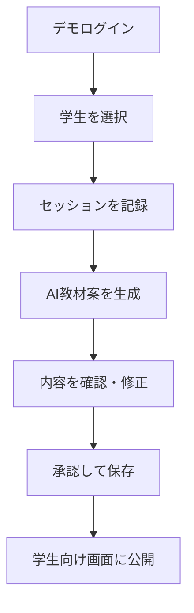
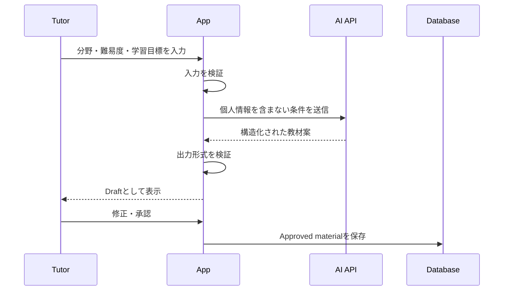
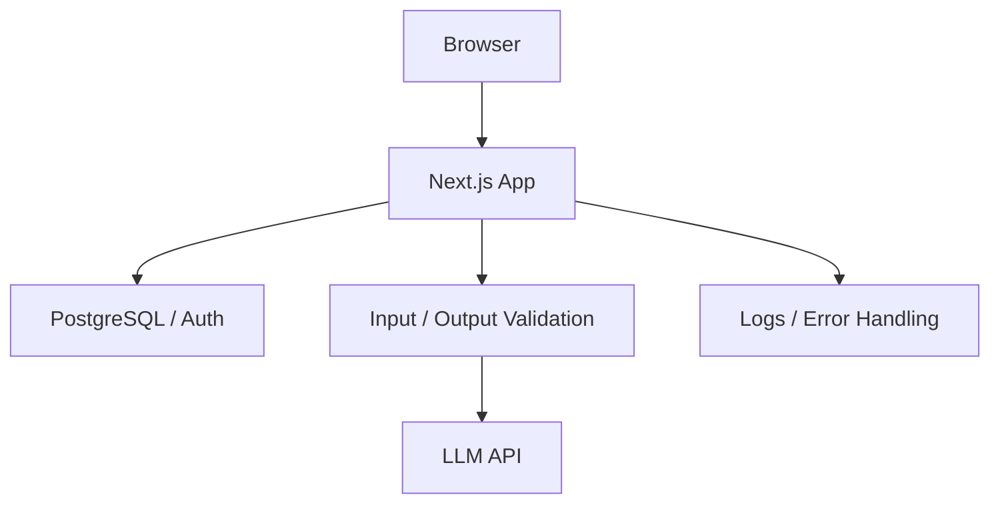

# TutorFlow AI ポートフォリオ開発計画

**版:** 1.0  
**作成日:** 2026年8月4日  
**用途:** 未経験IT就職向けポートフォリオ／開発専用スレッドへの引継ぎ資料

---

## 1. 結論

作るものは、数学チューターが学生ごとの学習記録を管理し、生成AIで練習問題・ヒントの下書きを作り、人間が確認・修正・承認してから利用できるWebアプリである。

仮称は **TutorFlow AI** とする。

これは「学生がAIに何でも質問するチャットボット」ではない。主役は人間のチューターであり、AIは教材作成を補助する道具として扱う。

### 一文で説明すると

> DVCで数学チューターを経験した学生が、学習記録と教材準備を効率化するために開発した、人間確認型のAIチューター支援アプリ。

### この作品で証明する能力

- 実体験から課題を発見し、製品要件へ落とす力
- TypeScriptを使ったWebアプリケーション開発
- データベースを使ったCRUD処理
- 外部AI APIとの連携
- AI出力を信用しすぎない設計
- 入力検証、認証、権限管理、秘密情報管理
- テスト、自動チェック、デプロイ
- GitHub上で開発過程を説明する力
- 日本語・英語環境を意識した設計

---

## 2. 開発者の経歴と制作に至る経緯

### 確定している経歴

- 2024年3月に日本の高等学校を卒業
- 2024年8月にDiablo Valley Collegeへ入学
- DVCではEngineeringを専攻
- 2026年7月〜8月にDVC内部で数学チューターとして勤務
- DVCへの入学時はDuolingo English Testを英語能力証明として使用
- TOEFLは未受験
- 2026年秋に日本へ帰国し、東京都内で未経験からIT・テクノロジー分野への就職を目指す
- 開発では生成AIを積極的に利用する方針

### 経歴から作品へつながる論理

```text
Engineeringで数学・工学を学ぶ
        ↓
DVCで数学チューターを経験する
        ↓
学生ごとに理解度、つまずき、次の課題が異なることを知る
        ↓
学習記録と教材準備を一つの場所で扱う必要性を考える
        ↓
AIで練習問題やヒントの下書きを作る
        ↓
ただしAIは誤答するため、人間の確認を必須にする
        ↓
TutorFlow AIを開発する
```

### 就活上の意味

この作品は、単に流行しているAIを使ったものではない。開発者本人の数学チューター経験から出発し、「何を解決するためのソフトウェアか」を説明できる。

また、情報系専攻や長期の実務経験がないことを隠さず、次の強みに変換する。

- 工学的な関心
- 英語環境での就学・就業経験
- 数学を相手に合わせて説明した経験
- AIを道具として使いながら、自分で検証する姿勢

---

## 3. 開発前に確認する事実

以下は現時点で仮説であり、実際のチューター経験として事実だったかを開発開始時に確認する。

- セッション記録はどのように残していたか
- 学生ごとの理解度や次回課題を管理していたか
- 練習問題の準備に時間がかかったか
- 学生がつまずく箇所を後から振り返りにくかったか
- 同じ説明を複数の学生向けに作り直すことがあったか
- チューター同士で情報共有する必要があったか

事実でなかった問題を面接で「実際に困った」と説明してはいけない。

### 事実確認後の表現

- 実際に経験した問題：`実体験`として説明する
- 経験から着想したが未経験の問題：`こうした課題が起こり得ると考えた`と説明する
- 完全な仮説：`検証したい仮説`として扱う

---

## 4. 解決する問題

### 中心となる問題

数学チューターが、学生ごとの学習状況を記録し、次回の教材を準備する作業は分散しやすい。生成AIを使えば教材案を速く作れるが、数学的な誤り、不適切な難易度、説明不足が含まれる可能性がある。

そこで、次の二つを同時に解決する。

1. 学生・セッション・次回課題を構造化して記録する
2. AIの教材案を人間が確認してから利用できるようにする

### 解決しない問題

- 学校の正式な成績管理
- 教員の代替
- 宿題の自動採点を学校へ提出する仕組み
- 学生がAIから無制限に答えを得る仕組み
- 医療・障害・心理状態の判断
- DVCの既存システムとの連携
- 実在学生の個人情報管理

---

## 5. 想定利用者

### Persona A：Peer Tutor

- 大学や学習センターで数学を教える学生チューター
- 複数の学生を担当する
- セッション後に短い記録を残したい
- 次回用の問題を準備したい
- AIは使いたいが、誤答をそのまま学生へ見せたくない

### Persona B：Student

- 数学の特定分野で学習支援を受ける学生
- 自分向けに承認された練習問題とヒントを確認する
- AIの生の回答ではなく、チューターが確認した内容だけを見る

### デモ上の扱い

ポートフォリオでは、すべて架空のチューター・学生・学習記録を使用する。

---

## 6. 製品原則

1. **Human in the loop:** AIが作った内容は、人間の承認前には学生へ公開しない
2. **Demo privacy:** 実在学生の情報を使わない
3. **Explainability:** なぜその問題・難易度を選んだか説明できる
4. **Small scope:** 一つの流れを完全に動かすことを優先する
5. **Bilingual awareness:** 日本語と英語の両方を意識する
6. **Honest AI use:** AIを使った範囲と人間が判断した範囲を公開する
7. **Reproducibility:** READMEだけで第三者が構成を理解できる

---

## 7. 完成時のユーザーフロー

### Tutor Flow



### AI教材生成フロー



---

## 8. 機能要件

### P0：最小完成版に必須

#### 8.1 デモログイン

- チューター用デモアカウント
- 学生用デモアカウント
- 本番サービスとしての一般登録は不要
- デモ利用方法をトップページに表示

#### 8.2 学生管理

- 架空学生の一覧表示
- 架空学生の追加
- 表示名、対象分野、現在の学習目標を編集
- 架空学生を削除または非表示

#### 8.3 セッション管理

- 日付
- 数学分野
- 扱った内容
- 理解度（1〜5）
- つまずいた点
- 次回の目標
- チューター用メモ
- 作成・編集・削除

#### 8.4 AI教材案生成

- 数学分野を指定
- 難易度を指定
- 問題数を指定
- 学習目標を入力
- 練習問題、段階的ヒント、解答手順、よくある誤りを生成
- 読み込み中、失敗、再試行を表示

#### 8.5 人間による確認

- AI出力は最初に`Draft`として保存
- チューターが問題・ヒント・解答を編集可能
- `Approve`を押すまで学生画面には表示しない
- 却下理由を任意で記録

#### 8.6 学生向け画面

- 承認済み教材のみ表示
- 問題とヒントを段階的に表示
- 解答は最初から見せず、明示的な操作で表示
- Draftや内部メモを表示しない

#### 8.7 基本品質

- スマートフォン表示
- エラーメッセージ
- 空入力・異常値の検証
- APIキーをブラウザへ渡さない
- デモデータのリセット手順

### P1：P0完成後に追加

- 日本語・英語の表示切替
- 学生ごとの理解度推移
- 分野別のセッション数
- 教材の再生成履歴
- AI出力と人間の修正版の差分表示
- ダークモード
- CSVエクスポート

### P2：時間が余った場合のみ

- 複数チューター
- チューター間の教材共有
- 教材テンプレート
- 数式表示の改善
- アクセシビリティ監査
- E2Eテストの拡張

### 今回作らないもの

- DVCのロゴ・名称を使った公式サービス風デザイン
- 実在学生のログイン
- 課金
- 学校システムとのSSO
- 本人確認
- 本格的な通知機能
- モバイルアプリ
- AIモデルの学習・ファインチューニング

---

## 9. 画面一覧

| 画面 | 目的 | P0 |
|---|---|---:|
| Landing | 作品概要、デモ方法、注意事項 | 必須 |
| Demo Login | Tutor／Studentの選択 | 必須 |
| Tutor Dashboard | 学生、最近のセッション、未承認教材 | 必須 |
| Student List | 架空学生の一覧・追加 | 必須 |
| Student Detail | 学習目標、履歴、教材 | 必須 |
| Session Editor | セッション記録 | 必須 |
| Material Generator | AI生成条件の入力 | 必須 |
| Material Review | AI案の修正・承認・却下 | 必須 |
| Student View | 承認済み教材の表示 | 必須 |
| About／Architecture | 技術、AI利用、注意事項 | 必須 |
| Analytics | 理解度や分野別の可視化 | P1 |

---

## 10. データ設計

### profiles

| フィールド | 型 | 説明 |
|---|---|---|
| id | UUID | ユーザー識別子 |
| role | enum | tutor / student |
| display_name | text | 架空の表示名 |
| locale | enum | ja / en |

### students

| フィールド | 型 | 説明 |
|---|---|---|
| id | UUID | 架空学生ID |
| tutor_id | UUID | 担当チューター |
| alias | text | 架空名 |
| current_level | text | 現在の水準 |
| learning_goal | text | 学習目標 |
| active | boolean | 表示状態 |

### sessions

| フィールド | 型 | 説明 |
|---|---|---|
| id | UUID | セッションID |
| student_id | UUID | 対象学生 |
| session_date | date | 実施日 |
| topic | text | 数学分野 |
| understanding | integer | 1〜5 |
| summary | text | 扱った内容 |
| difficulty_notes | text | つまずいた点 |
| next_goal | text | 次回目標 |
| private_notes | text | チューターのみ閲覧 |

### materials

| フィールド | 型 | 説明 |
|---|---|---|
| id | UUID | 教材ID |
| student_id | UUID | 対象学生 |
| session_id | UUID nullable | 関連セッション |
| topic | text | 数学分野 |
| difficulty | enum | introductory / standard / advanced |
| status | enum | draft / approved / rejected |
| ai_draft | JSON | AIが生成した原案 |
| approved_content | JSON nullable | 人間が確認した内容 |
| rejection_reason | text nullable | 却下理由 |
| prompt_version | text | 使用プロンプトの版 |
| approved_at | timestamp nullable | 承認日時 |

### generation_runs

| フィールド | 型 | 説明 |
|---|---|---|
| id | UUID | 生成実行ID |
| material_id | UUID | 対象教材 |
| model_label | text | 使用モデルの表示名 |
| latency_ms | integer | 応答時間 |
| success | boolean | 成否 |
| validation_error | text nullable | 検証失敗内容 |
| created_at | timestamp | 実行日時 |

モデルへ送った秘密情報や実在個人情報は保存しない。

---

## 11. AI出力仕様

AIには自由文ではなく、次のような構造化出力を要求する。

```json
{
  "topic": "Quadratic equations",
  "difficulty": "standard",
  "learning_objective": "Solve a quadratic equation by factoring",
  "problems": [
    {
      "question": "x^2 - 5x + 6 = 0 を解いてください。",
      "hints": [
        "積が6、和が-5になる2数を考えます。",
        "式を2つの一次式へ因数分解します。"
      ],
      "solution_steps": [
        "x^2 - 5x + 6 = (x - 2)(x - 3)",
        "したがって x = 2 または x = 3"
      ],
      "common_mistakes": [
        "符号を誤って(x + 2)(x + 3)とする"
      ]
    }
  ],
  "review_warning": "AI-generated draft. Verify all mathematics before approval."
}
```

### 検証ルール

- 必須フィールドが存在する
- 難易度が定義済みの値である
- 問題数が指定範囲内である
- ヒントと解答が空でない
- Draftであることを画面に明示する
- 構造検証に失敗した場合は保存しない
- AI API失敗時に再試行できる
- 自動検証が通っても、数学的正しさは人間が確認する

### Human Review Checklist

- 問題は解けるか
- 解答は正しいか
- 難易度は指定と合うか
- ヒントが答えをすぐ明かしていないか
- 説明が飛躍していないか
- 不適切な表現がないか
- 学生の個人情報が混入していないか

---

## 12. AI品質評価

AI機能を「動いた」で終わらせず、固定した10ケースで評価する。

### 評価対象例

- 一次方程式
- 連立方程式
- 二次方程式
- 関数
- 指数・対数
- 三角関数
- 微分
- 積分
- 確率
- 文章題

### 採点基準

| 項目 | 0 | 1 | 2 |
|---|---|---|---|
| 数学的正確さ | 誤り | 軽微な問題 | 正確 |
| 難易度一致 | 不一致 | 一部不一致 | 一致 |
| ヒント品質 | 不適切 | 改善余地 | 段階的 |
| 解答手順 | 欠落 | 一部飛躍 | 明確 |
| 出力形式 | 失敗 | 一部修正 | 完全 |

結果を`docs/ai-evaluation.md`へ記録する。AIモデルの性能を誇張せず、失敗例も一つ以上掲載する。

---

## 13. 技術構成

### 推奨スタック

| 領域 | 技術 | 理由 |
|---|---|---|
| Web | Next.js（安定版） | UIとサーバー処理を一つのプロジェクトで扱える |
| 言語 | TypeScript | 型安全と求人上の説明力 |
| UI | Tailwind CSS等 | 短期間で一貫した画面を作る |
| DB | PostgreSQL／Supabase | 実務に近いリレーショナルDB |
| Auth | Supabase Auth等 | デモ用の役割分離 |
| Validation | Zod等 | 入力・AI出力の構造検証 |
| AI | 構造化出力に対応するLLM API | 教材案生成 |
| Unit Test | Vitest等 | 検証ロジックを確認 |
| E2E | Playwright等 | 主要フローを確認 |
| CI | GitHub Actions | push時の自動チェック |
| Deploy | Vercel等 | 公開URLを作る |

特定ツールに固執せず、開発開始時に利用可能な安定版と無料枠を確認する。

### アーキテクチャ



### AI APIキー

- サーバー側の環境変数で管理
- Gitへコミットしない
- ブラウザへ送らない
- 公開デモには生成回数制限を設ける
- 利用料金アラートを設定する

---

## 14. セキュリティとプライバシー

### 必須

- 実在学生の名前、ID、成績、相談内容を使用しない
- 架空データであることを明記
- private_notesを学生画面へ返さない
- tutorは自分の架空学生だけを操作できる
- studentは承認済み教材だけを閲覧できる
- APIキーをクライアントへ露出しない
- 入力値を検証する
- AI生成エンドポイントへ簡易レート制限を入れる
- エラーログへ個人情報を残さない

### READMEの注意書き

```text
This is a portfolio demonstration and is not an official DVC product.
All student names and records are fictional.
AI-generated materials require human review and may contain errors.
```

DVCの公式ロゴ、校章、公式サービスと誤認される表現は使用しない。

---

## 15. UX・デザイン方針

- B2B SaaS型の落ち着いた画面
- 学習アプリ風の過剰なキャラクター表現は避ける
- Draft／Approvedを色だけでなく文字でも区別
- AI生成中、失敗、承認済みを明確に表示
- 数式が読みやすい余白と文字サイズ
- スマートフォンで主要操作が可能
- キーボード操作とラベルを意識

### デザインで最優先する画面

`Material Review`画面を作品の中心にする。

左側にAI原案、右側に編集・承認後の内容を置き、AIを盲信せず人間が責任を持つ設計が一目で伝わるようにする。

---

## 16. 開発にAIを使うルール

生成AIを使った開発自体は隠さない。ただし「AIが全部作った」状態にしない。

### AIに任せてよいこと

- 要件の抜け漏れ確認
- 小さなコードの下書き
- エラーメッセージの解説
- テストケース案
- READMEの構成案
- リファクタリング候補
- 英語表現の修正

### 開発者本人が担当すること

- 解決する問題の決定
- MVP範囲の決定
- データ設計の最終判断
- AI生成コードの読解
- 実行・デバッグ
- セキュリティ確認
- テスト結果の確認
- 画面と操作の最終判断
- READMEでの説明
- 面接での説明

### 禁止

- リポジトリ全体を理解せず一括生成
- エラーを読まずにAIへ貼り続ける
- APIキーをプロンプトやGitへ貼る
- 動作確認なしで機能完成とする
- 実装していない機能をREADMEへ書く
- AIの説明を自分の経験として話す

### 記録するファイル

`AI_USAGE.md`

```text
・AIを何に使用したか
・採用しなかった提案
・人間が変更した重要な判断
・AI生成コードで起きた問題
・自分で行った検証
```

`DEVLOG.md`

```text
日付
実装したもの
発生した問題
原因
解決方法
次に行うこと
```

---

## 17. リポジトリ構成案

```text
tutorflow-ai/
├─ app/
├─ components/
├─ lib/
│  ├─ ai/
│  ├─ auth/
│  ├─ db/
│  └─ validation/
├─ tests/
├─ docs/
│  ├─ architecture.md
│  ├─ ai-evaluation.md
│  └─ screenshots/
├─ public/
├─ .github/workflows/
├─ AI_USAGE.md
├─ DEVLOG.md
├─ README.md
└─ .env.example
```

機能を過度に細分化せず、初期段階では理解できる構成を優先する。

---

## 18. 10日間の開発計画

### 開始前：Phase 0（30〜60分）

- 実際のチューター業務を振り返る
- 実体験と仮説を分ける
- 使用するAI APIと費用上限を決める
- GitHubアカウントと公開範囲を確認
- 開発環境を確認

### Day 1：要件と土台

- リポジトリ作成
- READMEへ背景と目的を書く
- 画面一覧を決める
- データモデルを確定
- Next.js／TypeScriptの土台
- CIでlint・typecheckを実行

**完了条件:** 空のアプリがローカルで動き、GitHub Actionsが通る。

### Day 2：DBとデモログイン

- DB作成
- profiles、students、sessions、materialsを作る
- デモ用データ投入
- Tutor／Studentのデモログイン
- 権限の基本確認

**完了条件:** チューターと学生で見える画面が分かれる。

### Day 3：学生・セッションCRUD

- 学生一覧
- 学生詳細
- セッションの追加・編集・削除
- 入力検証
- エラー表示

**完了条件:** AIなしでも学習記録アプリとして使える。

### Day 4：AI教材案生成

- 生成フォーム
- サーバー側API
- 構造化出力
- 出力検証
- 失敗時の再試行
- Draft保存

**完了条件:** 架空条件から教材案を生成し、Draftとして表示できる。

### Day 5：レビュー・承認

- AI原案の編集
- Approve／Reject
- 承認済み内容の保存
- 学生画面ではApprovedのみ表示
- 権限テスト

**完了条件:** 中心フローが最初から最後まで動く。ここがMVP。

### Day 6：学生画面と進捗

- 承認済み教材
- ヒントの段階表示
- 解答の表示制御
- セッション履歴
- 簡単な進捗表示

### Day 7：品質

- 検証ロジックの単体テスト
- 主要フローのE2Eテスト
- APIキー確認
- レート制限
- 空状態、読み込み、失敗状態

### Day 8：公開

- デプロイ
- 環境変数設定
- デモデータ確認
- モバイル確認
- 第三者が説明なしで操作できるか確認

### Day 9：ドキュメント

- README
- 構成図
- スクリーンショット
- AI_USAGE.md
- DEVLOG.md
- AI評価10ケース
- 既知の問題

### Day 10：就活用仕上げ

- 不具合修正
- 90秒説明
- 5分デモ
- 履歴書・職務経歴書用の説明
- GitHubのピン留め
- 公開URL確認

---

## 19. Gitコミット計画

巨大な一回のコミットを避け、次のように分ける。

```text
docs: define product problem and MVP scope
chore: initialize Next.js and CI
feat: add demo authentication and roles
feat: add student and session management
feat: generate structured material drafts
feat: add human review and approval workflow
feat: show approved materials in student view
test: cover validation and approval permissions
docs: add architecture and AI usage notes
fix: handle generation failure and empty states
```

コミット履歴そのものを、開発手順を理解している証拠にする。

---

## 20. テスト計画

### Unit

- 理解度が1〜5以外なら拒否
- AI出力に必須項目がなければ拒否
- 難易度の不正値を拒否
- Draftは学生画面用データへ含めない
- Approvedだけ公開対象になる

### Integration

- チューターが学生とセッションを作成できる
- 学生はprivate_notesを取得できない
- AI生成失敗後に再試行できる
- 承認時にapproved_atが保存される

### E2E

1. Tutorとしてログイン
2. 架空学生を選択
3. セッションを記録
4. AI教材案を生成
5. 内容を修正
6. 承認
7. Studentとしてログイン
8. 承認済み教材だけが表示される

### Manual

- スマートフォン
- キーボード操作
- 長い数式
- API失敗
- 空データ
- 日本語と英語

---

## 21. Definition of Done

次のすべてを満たしたとき、作品を完成とする。

- [ ] 公開URLがある
- [ ] デモログイン方法が明確
- [ ] 学生・セッションCRUDが動く
- [ ] AI教材案を生成できる
- [ ] Draftを人間が修正・承認できる
- [ ] 学生画面にはApprovedだけ表示される
- [ ] 実在学生の情報を使っていない
- [ ] APIキーが公開されていない
- [ ] lint、typecheck、testが通る
- [ ] 主要フローのE2Eテストがある
- [ ] READMEに背景、技術、構成、起動方法がある
- [ ] AI_USAGE.mdがある
- [ ] AI評価結果と失敗例がある
- [ ] モバイルで主要操作ができる
- [ ] 90秒で説明できる
- [ ] 5分でデモできる

---

## 22. README構成

```text
# TutorFlow AI

## Demo
## Background
## Problem
## Solution
## Key Features
## Human-in-the-Loop AI Design
## Screenshots
## Architecture
## Tech Stack
## Data Model
## Security and Privacy
## AI Evaluation
## Local Setup
## Testing
## What I Learned
## Known Limitations
## Future Improvements
## Disclaimer
```

README冒頭で、DVCの公式製品ではないこと、すべて架空データであることを明記する。

---

## 23. 履歴書・職務経歴書での表現

### 開発中

```text
TutorFlow AI（個人開発／2026年8月〜）

DVCでの数学チューター経験を基に、学生ごとの学習記録と教材準備を
支援するWebアプリを開発中。生成AIが作成した練習問題・ヒントを、
チューターが確認・修正・承認してから学生へ公開する設計としている。
TypeScript、Next.js、PostgreSQLを使用予定。
```

### 完成後

```text
TutorFlow AI（個人開発／2026年8月）

DVCでの数学チューター経験を基に、学習記録と教材準備を支援する
Webアプリを設計・開発。学生・セッション管理、AI教材案生成、
人間による修正・承認、承認済み教材の学生向け表示を実装した。

AI出力をそのまま公開せず、構造検証と人間の承認を必須にした。
TypeScript、Next.js、PostgreSQL、外部AI APIを使用し、テスト、CI、
公開環境まで構築した。

GitHub：[URL]
Demo：[URL]
```

実装していない機能、使用していない技術は書かない。

---

## 24. 面接での説明

### 30秒版

```text
DVCで数学チューターとして働いた経験を基に、学習記録と教材準備を
支援するTutorFlow AIを開発しました。AIが練習問題やヒントの案を
作りますが、誤答の可能性があるため、人間のチューターが修正・承認
してから学生へ公開する設計にしています。
```

### 90秒版

```text
2026年夏にDVCで数学チューターとして勤務した経験から、学生ごとの
理解度や次回課題を記録し、練習問題を準備する作業を一つの場所で
扱えると便利だと考え、TutorFlow AIを開発しました。

学生・セッションの管理に加え、分野や難易度を指定するとAIが練習問題、
段階的ヒント、解答手順の案を生成します。ただし、数学ではAIの誤答が
大きな問題になるため、生成内容はDraftとして保存し、チューターが確認・
修正・承認するまで学生には表示しない設計にしました。

開発ではTypeScript、Next.js、PostgreSQLを使い、AI出力の構造検証、
権限管理、テスト、CI、デプロイまで取り組みました。生成AIはコードの
下書きや調査にも使いましたが、要件、設計、検証、修正内容は記録し、
自分で説明できる状態にしています。
```

### 聞かれやすい質問

- なぜこの作品を作ったのか
- 実際のチューター業務で何に困ったのか
- AIを使わず通常の問題集ではだめなのか
- AIが誤答した場合どうするのか
- AIにコードを書かせただけではないか
- 一番難しかったバグは何か
- DB設計をどう決めたか
- 学生の個人情報をどう守るか
- もう一週間あれば何を改善するか

回答は開発中のDEVLOGを基に、自分が実際に判断した事実だけを話す。

---

## 25. リスクと対策

| リスク | 対策 |
|---|---|
| 機能を増やしすぎる | P0以外をDay 5まで作らない |
| AIコードを理解できない | 小単位で生成し、各変更を実行・説明する |
| AIが数学的に誤る | Draft、構造検証、人間承認、評価結果公開 |
| 認証で時間を使う | デモアカウントに限定する |
| API費用が増える | 回数制限、料金アラート、デモデータ |
| 実在学生情報が混入 | 架空データのみ、READMEに明記 |
| デザインに時間を使う | Material Reviewを中心に最低限整える |
| 完成まで応募できない | Day 5でGitHubを「開発中」として掲載 |
| 面接で説明できない | DEVLOGと90秒説明を毎日更新 |

---

## 26. 開発専用スレッドの開始文

新しいスレッドにこのファイルを添付し、次の文章を送る。

```text
添付の「TutorFlow AI ポートフォリオ開発計画」に従って、
ポートフォリオを実際に開発したいです。

背景：
- 2024年8月からDVCのEngineering専攻に在籍
- 2026年7月〜8月にDVC内部で数学チューターとして勤務
- 2026年秋に日本へ帰国し、東京都内で未経験IT就職を目指す
- 生成AIを活用して開発するが、生成コードを理解・検証できる形にしたい

守ってほしいこと：
1. 最初にPhase 0として、実際のチューター業務と開発環境について
   最大5問の確認をする
2. 実体験と仮説を混同しない
3. P0のMVPを最優先し、勝手に機能を増やさない
4. 一度に大量のコードを生成せず、小さな単位で実装・確認する
5. 各段階で、私が面接で説明すべき技術的判断を教える
6. lint、typecheck、testを継続して実行する
7. 実在学生の情報やDVCの公式ロゴを使わない
8. AI APIキーをコードやGitへ入れない
9. Day 5で公開可能なMVPを完成させる
10. AI_USAGE.mdとDEVLOG.mdを更新しながら進める

まずはコードを書かず、Phase 0の確認質問から始めてください。
```

---

## 27. 開発開始時に回答する質問

1. 数学チューターとして、実際にはどのレベル・分野を担当したか
2. セッション記録や教材準備をどのように行っていたか
3. 実際に時間がかかった、または改善したいと感じた作業は何か
4. 使用できるPC、OS、GitHub、エディタ、Node.js環境
5. 使用したいAI APIと、月額費用の上限

この5点を確定してから、要件の「実体験」と「仮説」を最終的に分ける。

---

## 28. 最終成果物

開発完了時には次が揃っている状態を目指す。

- 公開されたTutorFlow AI
- GitHubリポジトリ
- 日本語・英語概要を含むREADME
- AI_USAGE.md
- DEVLOG.md
- アーキテクチャ図
- データモデル
- AI評価結果
- テスト
- GitHub Actions
- デモ用架空データ
- スクリーンショット
- 履歴書用説明
- 30秒・90秒・5分の説明

最終目的は「多機能なサービス」を作ることではない。

**本人の経歴から生まれた課題を、AIを適切に制御しながら、動くWebアプリとして完成させ、その判断を自分の言葉で説明できること**が完成条件である。
