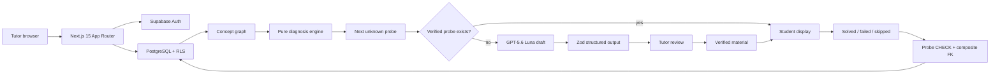

# Architecture

The browser never receives the OpenAI key or service-role key. Server Components use the read-oriented Supabase client; Server Actions and Route Handlers use the cookie-writing action client. The three existing clients remain separate.

`lib/diagnosis/engine.ts` has no database or React dependency. A Server Component loads concepts, edges, and persisted probe observations, reconstructs state, and passes only a verified problem into the client-side student display.

The AI probe prompt accepts only a concept code and English label. Student aliases, consultation notes, and private notes cannot enter its function signature.

Unverified material can appear only as a tutor-facing review link. Its JSON content is not selected for or passed to the student display.
