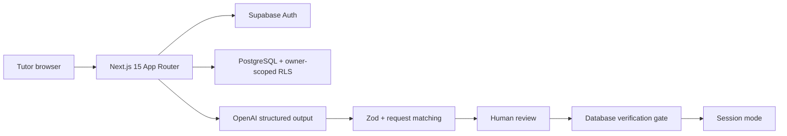

# Architecture

The browser never receives the OpenAI key or service-role key. Server Components use a read-oriented Supabase client whose cookie writes are safely ignored; Server Actions and Route Handlers use a separate client that can refresh authentication cookies.

The AI prompt builder accepts only topic, difficulty, problem count, and learning objective. Student aliases and private notes do not fit its function signature.
