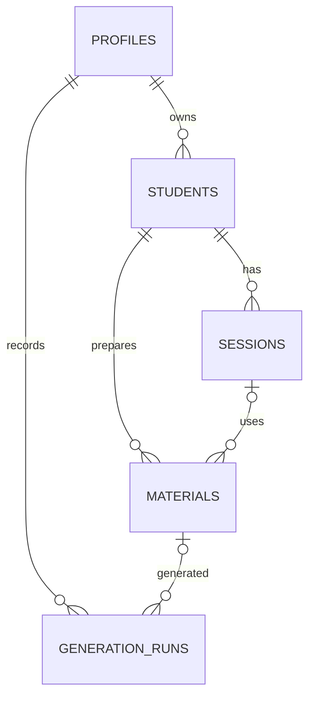

# Data model

The schema has five tables and three material CHECK constraints:

1. `materials_verified_consistency` requires verified content and a verification timestamp whenever state is `verified`.
2. `materials_discarded_consistency` prevents a discard reason from appearing on a non-discarded material.
3. `materials_session_requires_verified` permits a session link only when state is `verified`. This is the core product guarantee and applies even if a write bypasses the interface.

PostgreSQL enums map directly to the `DifficultyLevel` and `MaterialState` TypeScript unions in `lib/db/types.ts`. Every DDL column, nullability rule, insert shape, and update shape was transcribed manually and then exercised by TypeScript compilation.

The `seed_demo_workspace(demo_id)` PostgreSQL function resets the selected fictional demo profile in one transaction. It remains `SECURITY INVOKER`, so calls made by the application continue to use the caller's RLS permissions, and it rejects profiles that are not marked as demo accounts. Seeded generation history uses past timestamps so a reset does not consume the current one-hour demo generation allowance.
