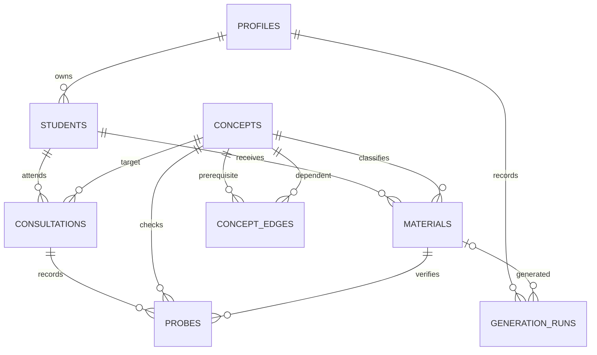

# Data model



## Tables

- `profiles`: authenticated tutor profile and demo flag.
- `students`: owner-scoped aliases and learning goals.
- `concepts`: shared authenticated-read taxonomy with stable code and depth.
- `concept_edges`: directed prerequisite-to-dependent edges.
- `consultations`: resumable drop-in diagnosis with target and optional root blocker.
- `materials`: practice or probe content, its concept, review state, and model provenance.
- `probes`: one persisted diagnostic result per consultation step.
- `generation_runs`: rate-limit and AI reliability audit rows.

The former `sessions` table is migrated into `consultations` by `0008_replace_sessions.sql` and then removed. Legacy rows retain their date, topic, summary, difficulty notes, next goal, and private notes; they have no inferred target concept.

## Verified-material composite foreign key

`materials` has `UNIQUE (id, state)`. Each `probes` row stores the deliberately redundant pair `(material_id, material_state)`.

```sql
constraint probes_material_must_be_verified check (material_state = 'verified'),
constraint probes_material_fk foreign key (material_id, material_state)
  references materials (id, state) on update cascade
```

The CHECK prevents a probe row from claiming any state other than `verified`. The composite foreign key proves that the referenced material really has that state. `ON UPDATE CASCADE` is required: if code attempts to change a referenced material from `verified` to `unverified` or `discarded`, the cascaded value violates the probe CHECK and PostgreSQL rejects the update.

This three-part construction is the core safety guarantee. Removing `material_state`, the CHECK, the unique target, or the update cascade would weaken it.

## RLS

Students, consultations, materials, probes, and generation runs are owner-scoped. Concepts and edges have authenticated read-only policies because they form a shared taxonomy. Anonymous access has no policy on any table.

## Demo reset

`seed_demo_workspace(demo_id)` rejects non-demo profiles, rebuilds fictional v4 data in one transaction, and inserts the 18-node graph when absent. Every seeded `generation_runs.created_at` value is in the past, preventing an immediate demo rate-limit lockout after reset.
